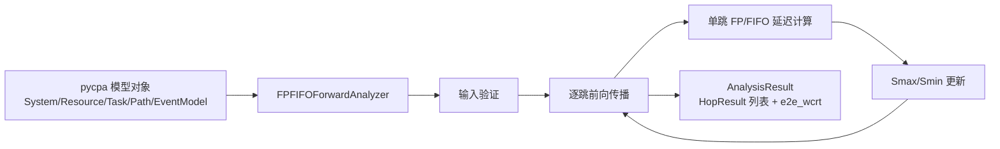
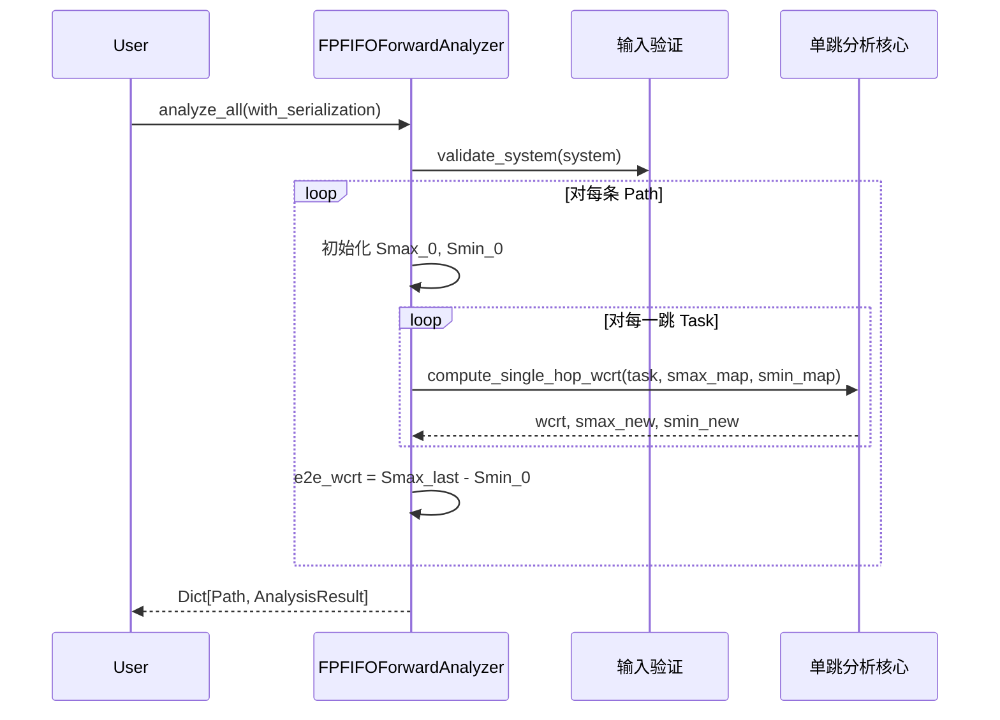

# 设计文档：AFDX FP/FIFO 前向端到端延迟分析

## 概述

本设计实现论文 "Forward end-to-end delay analysis extension for FP/FIFO policy in AFDX networks"（Benammar 等，2017）中提出的前向分析方法。该方法针对 AFDX 网络中固定优先级（FP）与 FIFO 组合调度策略，通过逐跳前向传播 Smax/Smin 来计算更紧凑的最坏情况端到端延迟上界。

### 设计决策

1. **模块文件命名**：现有 `forward_analysis/__init__.py` 从 `.analyzer` 导入 `FPFIFOForwardAnalyzer`，但需求文档指定核心逻辑放在 `fa_fpfifo.py` 中。设计决策：将核心分析逻辑实现在 `forward_analysis/fa_fpfifo.py` 中，同时创建 `forward_analysis/analyzer.py` 作为薄封装层，从 `fa_fpfifo` 导入并重新导出 `FPFIFOForwardAnalyzer`，以保持 `__init__.py` 的导入路径不变。
2. **独立分析**：不依赖 pycpa 的 `analysis`、`schedulers` 或 `path_analysis` 模块，仅读取 `pycpa.model` 中的模型对象。
3. **ForwardingTask 处理**：分析过程中跳过 `ForwardingTask` 类型的任务（它们表示交换机转发延迟，不参与 FP/FIFO 调度竞争），转发延迟通过 `Resource.forwarding_delay` 属性配置。

## 架构

### 模块结构

```
forward_analysis/
├── __init__.py          # 包入口，导出 FPFIFOForwardAnalyzer
├── analyzer.py          # 薄封装层，从 fa_fpfifo 导入
└── fa_fpfifo.py         # 核心分析逻辑

examples/
└── afdx_forward_analysis/
    └── example_fpfifo.py  # 示例与验证脚本
```

### 数据流



### 分析流程



## 组件与接口

### FPFIFOForwardAnalyzer 类

主分析器类，提供完整的前向分析接口。

```python
class FPFIFOForwardAnalyzer:
    """AFDX FP/FIFO 前向端到端延迟分析器。"""

    def __init__(self, system: model.System):
        """
        初始化分析器。
        :param system: pycpa System 对象，包含完整的网络模型
        """

    def analyze_all(self, with_serialization: bool = False) -> Dict[model.Path, AnalysisResult]:
        """
        分析系统中所有已注册 Path 的端到端延迟。
        :param with_serialization: 是否启用序列化效应分析
        :return: 以 Path 为键的分析结果字典
        """

    def analyze_path(self, path: model.Path, with_serialization: bool = False) -> AnalysisResult:
        """
        分析单条 Path 的端到端延迟。
        :param path: pycpa Path 对象
        :param with_serialization: 是否启用序列化效应分析
        :return: 该 Path 的分析结果
        """

    def print_results(self, results: Dict[model.Path, AnalysisResult] = None) -> None:
        """
        以可读格式打印分析结果。
        :param results: 分析结果字典，若为 None 则打印最近一次 analyze_all 的结果
        """
```

### 内部方法

```python
def _validate_path(self, path: model.Path) -> None:
    """验证 Path 的所有 Task 是否满足分析前提条件。"""

def _get_analysis_tasks(self, path: model.Path) -> List[model.Task]:
    """从 Path.tasks 中过滤掉 ForwardingTask，返回参与 FP/FIFO 调度的任务列表。"""

def _init_smax_smin(self, task: model.Task) -> Tuple[float, float]:
    """根据源端 EventModel 初始化第一跳的 Smax_0 和 Smin_0。"""

def _compute_single_hop_wcrt(
    self,
    task: model.Task,
    smax_map: Dict[model.Task, float],
    smin_map: Dict[model.Task, float],
    with_serialization: bool
) -> float:
    """
    计算单跳最坏情况响应时间。
    包含：高优先级干扰 + 同优先级 FIFO 干扰 + 低优先级阻塞 + 自身传输时间。
    """

def _compute_hp_interference(
    self,
    task: model.Task,
    smax_map: Dict[model.Task, float],
    smin_map: Dict[model.Task, float]
) -> float:
    """计算高优先级流量的抢占干扰量。"""

def _compute_sp_fifo_interference(
    self,
    task: model.Task,
    smax_map: Dict[model.Task, float],
    smin_map: Dict[model.Task, float],
    with_serialization: bool
) -> float:
    """计算同优先级流量的 FIFO 排队干扰量。"""

def _compute_lp_blocking(self, task: model.Task) -> float:
    """计算低优先级流量的非抢占阻塞量。"""

def _get_technological_latency(self, resource: model.Resource) -> float:
    """获取交换机端口的技术延迟（转发延迟）。"""
```

## 数据模型

### HopResult

```python
@dataclass
class HopResult:
    """单跳分析结果。"""
    hop_index: int          # 跳索引（从 0 开始）
    resource_name: str      # 对应 Resource 的名称
    task_name: str          # 对应 Task 的名称
    smax: float             # 该跳输出处的 Smax（最大累积延迟）
    smin: float             # 该跳输出处的 Smin（最小累积延迟）
    wcrt: float             # 该跳的最坏情况响应时间
```

### AnalysisResult

```python
@dataclass
class AnalysisResult:
    """单条 Path 的完整分析结果。"""
    path: model.Path                # 对应的 Path 对象
    path_name: str                  # Path 名称
    hop_results: List[HopResult]    # 逐跳结果列表
    e2e_wcrt: float                 # 端到端最坏情况延迟上界
    smax_initial: float             # 初始 Smax 值
    smin_initial: float             # 初始 Smin 值
```

### 核心算法：逐跳前向传播

对于 VL 路径上的每一跳 h，被分析流 vi 的 Smax 和 Smin 更新规则如下：

**初始化（第一跳之前）：**
- `Smax_i^0 = J_i`（源端抖动）
- `Smin_i^0 = 0`

**逐跳传播：**
- `Smax_i^h = Smax_i^{h-1} + R_i^h + tech_latency^h`
- `Smin_i^h = Smin_i^{h-1} + bcet_i + tech_latency^h`

其中 `R_i^h` 为第 h 跳的最坏情况响应时间：

`R_i^h = C_i + HP_interference + SP_FIFO_interference + LP_blocking`

- `C_i`：被分析帧自身的最坏情况传输时间（wcet）
- `HP_interference`：所有高优先级流在忙期内的累积干扰
- `SP_FIFO_interference`：同优先级流在 FIFO 队列中的排队干扰
- `LP_blocking`：最大低优先级帧的非抢占阻塞

**高优先级干扰计算：**

对于每个高优先级流 vj（`priority_j < priority_i`，数值越小优先级越高）：

`HP_interference = Σ_j ceil((R_i^h + J_j^h) / P_j) * C_j`

其中 `J_j^h = Smax_j^{h-1} - Smin_j^{h-1}` 为流 vj 在第 h 跳输入处的等效抖动。

此公式需要迭代求解（因为 R_i^h 出现在等式两侧），使用不动点迭代直到收敛。

**同优先级 FIFO 干扰计算：**

对于每个同优先级流 vj（`priority_j == priority_i`）：

不启用序列化时：
`SP_FIFO_interference = Σ_j min(ceil((Smax_j^{h-1} - Smin_i^{h-1} + epsilon) / P_j), 1+floor(J_j^{h-1}/P_j)) * C_j`

其中关键思想是：利用 Smax_j 和 Smin_i 的差值来确定流 vj 最多有多少帧可能在流 vi 的帧之前到达同一 FIFO 队列。

启用序列化时：来自同一输入端口的帧受序列化约束，不会同时到达，需要从干扰量中扣除相应的帧数。

**低优先级阻塞计算：**

`LP_blocking = max_j(C_j)` 对所有低优先级流 vj（`priority_j > priority_i`）

**端到端延迟：**

`e2e_delay_i = Smax_i^{last_hop} - Smin_i^0`

### 分析顺序

由于同优先级 FIFO 干扰计算需要竞争流的 Smax/Smin 信息，分析器需要按以下策略处理：

1. 对所有 Path 的所有 Task，初始化 Smax/Smin 映射表
2. 逐跳分析：对于第 h 跳，先分析所有经过该跳的流，再进入第 h+1 跳
3. 在同一跳内，各流的分析使用前一跳已计算完成的 Smax/Smin 值

实际实现中，由于 AFDX 网络的拓扑特性（树形多播），可以简化为：对每条 Path 独立逐跳分析，在计算同优先级干扰时，查询竞争流在前一跳的 Smax/Smin（如果竞争流尚未分析到该跳，则使用其源端初始值加上保守估计）。

为确保正确性，分析器采用两轮策略：
1. 第一轮：为所有 Path 的所有 Task 初始化 Smax/Smin（使用源端 EventModel）
2. 第二轮：逐跳前向传播，按跳层级（hop level）遍历所有流，确保同一跳的所有流使用一致的前一跳 Smax/Smin 值


## 正确性属性

*正确性属性是在系统所有有效执行中都应成立的特征或行为——本质上是关于系统应该做什么的形式化陈述。属性是人类可读规范与机器可验证正确性保证之间的桥梁。*

### 属性 1：Smax ≥ Smin 不变量

*对于任意*有效的 AFDX 网络配置和任意 VL 路径，在每一跳的分析结果中，Smax 值始终大于或等于 Smin 值。

**验证需求：2.4, 2.5, 2.6**

### 属性 2：Smax 和 Smin 沿路径单调非递减

*对于任意*有效的 AFDX 网络配置和任意 VL 路径，逐跳结果中 Smax 序列和 Smin 序列均单调非递减（每一跳的值 ≥ 前一跳的值）。

**验证需求：2.5, 2.6, 4.2**

### 属性 3：端到端延迟等于 Smax_last - Smin_initial

*对于任意*分析结果，端到端最坏情况延迟 e2e_wcrt 等于最后一跳的 Smax 值减去初始 Smin 值。

**验证需求：4.3**

### 属性 4：端到端延迟下界

*对于任意*有效的 AFDX 网络配置和任意 VL 路径，端到端最坏情况延迟 e2e_wcrt 大于或等于路径上所有跳的 bcet 之和加上所有跳的技术延迟之和。

**验证需求：2.4, 4.3, 4.4**

### 属性 5：序列化效应单调性

*对于任意*有效的 AFDX 网络配置和任意 VL 路径，启用序列化分析模式得到的端到端延迟 ≤ 未启用序列化分析模式得到的端到端延迟。

**验证需求：3.1**

### 属性 6：所有结果非负

*对于任意*有效的 AFDX 网络配置和任意分析结果，所有 Smax、Smin、wcrt 和 e2e_wcrt 值均为非负数。

**验证需求：2.4, 2.5, 2.6, 4.3**

### 属性 7：分析确定性

*对于任意*有效的 AFDX 网络配置，对同一输入执行两次分析（相同的 with_serialization 参数），两次结果完全相同。

**验证需求：6.1, 6.2**

### 属性 8：结果结构完整性

*对于任意*有效的 AFDX 网络配置和任意分析结果，AnalysisResult 包含有效的 path 引用、非空的 hop_results 列表和 e2e_wcrt 值；每个 HopResult 包含有效的 hop_index、resource_name、task_name、smax、smin 和 wcrt 字段；analyze_all 返回的字典以 Path 对象为键。

**验证需求：6.3, 7.1, 7.2, 7.3**

### 属性 9：无效输入验证

*对于任意*包含以下任一缺陷的输入配置——Task 未绑定 Resource、首个 Task 缺少 in_event_model、Task 的 wcet ≤ 0、Task 缺少 scheduling_parameter——分析器应抛出 ValueError 异常。

**验证需求：8.1, 8.2, 8.3, 8.4**

### 属性 10：跳结果顺序与路径任务顺序一致

*对于任意*有效的 AFDX 网络配置和任意 VL 路径，分析结果中 hop_results 列表的顺序与 Path.tasks 中参与 FP/FIFO 调度的任务顺序一致，且 hop_index 从 0 开始连续递增。

**验证需求：1.5, 7.1**

### 属性 11：低优先级阻塞上界

*对于任意*有效的 AFDX 网络配置和任意跳，低优先级阻塞量等于该跳所有低优先级流中最大 wcet 值（若无低优先级流则为 0）。

**验证需求：2.3**

### 属性 12：初始 Smax/Smin 正确性

*对于任意*有效的 VL 路径，第一跳分析前的初始 Smax 值等于源端 EventModel 的抖动 J，初始 Smin 值等于 0。

**验证需求：4.1**

## 错误处理

### 输入验证错误

| 错误条件 | 异常类型 | 错误信息模板 |
|---------|---------|------------|
| Task 未绑定 Resource | `ValueError` | `"Task '{task.name}' is not bound to any Resource"` |
| 首个 Task 缺少 EventModel | `ValueError` | `"First task '{task.name}' in path '{path.name}' has no in_event_model"` |
| Task 的 wcet ≤ 0 | `ValueError` | `"Task '{task.name}' has invalid wcet={task.wcet} (must be > 0)"` |
| Task 缺少 scheduling_parameter | `ValueError` | `"Task '{task.name}' has no scheduling_parameter"` |
| Path 无有效分析任务 | `ValueError` | `"Path '{path.name}' has no analyzable tasks (after filtering ForwardingTasks)"` |

### 运行时错误

| 错误条件 | 处理策略 |
|---------|---------|
| 不动点迭代不收敛 | 设置最大迭代次数（默认 1000），超过后抛出 `RuntimeError`，提示可能存在不可调度配置 |
| System 无已注册 Path | `analyze_all` 返回空字典，不抛出异常 |
| Path.tasks 为空列表 | 在 `_validate_path` 中抛出 `ValueError` |

### 警告

| 条件 | 处理策略 |
|-----|---------|
| Task 的 bcet > wcet | 由 pycpa 的 Task.__init__ 中的 assert 保证不会发生 |
| 分析结果中 e2e_wcrt 超过 BAG | 记录警告日志，提示可能存在调度问题 |

## 测试策略

### 双重测试方法

本功能采用单元测试与属性测试相结合的双重测试策略：

- **单元测试**：验证特定示例、边界情况和错误条件
- **属性测试**：验证在所有有效输入上成立的通用属性

两者互补，共同提供全面的测试覆盖。

### 属性测试

**测试库**：使用 [Hypothesis](https://hypothesis.readthedocs.io/) 作为 Python 属性测试库。

**配置要求**：
- 每个属性测试至少运行 100 次迭代（`@settings(max_examples=100)`）
- 每个属性测试必须通过注释引用设计文档中的属性编号
- 标签格式：`# Feature: afdx-fpfifo-forward-analysis, Property {number}: {property_text}`
- 每个正确性属性由一个属性测试实现

**生成器策略**：
- 生成随机的 AFDX 网络配置（交换机数量、VL 数量、优先级分配、帧大小、BAG 值）
- 使用 Hypothesis 的 `@composite` 策略构建有效的 pycpa 模型对象
- 确保生成的配置满足基本约束（bcet ≤ wcet, wcet > 0, P > 0 等）
- 生成器应覆盖边界情况：单跳路径、单流网络、所有流同优先级、无低优先级流等

**属性测试列表**（对应设计文档中的 12 个属性）：

每个属性测试必须以单个属性测试实现，标签格式示例：
```python
# Feature: afdx-fpfifo-forward-analysis, Property 1: Smax >= Smin invariant
@given(afdx_config=valid_afdx_system())
@settings(max_examples=100)
def test_smax_ge_smin(afdx_config):
    ...
```

### 单元测试

单元测试聚焦于以下方面：

1. **特定示例**：使用论文中的数值案例验证分析结果的正确性
2. **边界情况**：
   - 单跳路径
   - 单流网络（无竞争流量）
   - 所有流同优先级（纯 FIFO）
   - 无低优先级流（LP blocking = 0）
   - 技术延迟为 0 的默认情况
   - 包含 ForwardingTask 的路径（应被正确跳过）
3. **错误条件**：
   - 各种无效输入配置（对应需求 8 的验收标准）
4. **集成点**：
   - 验证 `analyze_all` 与 `analyze_path` 结果一致性
   - 验证 `print_results` 不抛出异常

### 测试文件结构

```
test/
├── test_fa_fpfifo.py           # 属性测试 + 单元测试
└── conftest.py                 # Hypothesis 生成器策略（如需要）
```
